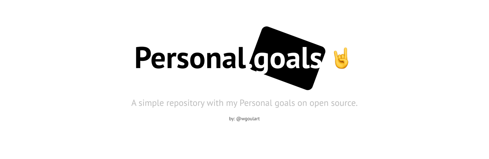

## Overarching Goals

1. Create Blog & Write blog posts
2. Contribute to Open Source
3. Get better at English, Programming & Comunication.
4. Learn about React, Vue.js, WebAnimations API, Javascript Vanilla, ES6, Webpack & Electron.
5. Read My Books that I haven't finished yet 📝

## Follow my Dailylog

### 📝 [Dailylog](https://github.com/wgoulart/dailylog) :metal:

## Things I'll Do This Month: January 2018

* [ ] Create a website & blog
* [ ] Practice Meditation
* [ ] Finish any Course on my [list](courses.md).
* [ ] Reade my books i havan't finished - [My Books](books.md).

## Things I'll Do This Month: February 2018
* [ ] Finish all the things of the month of January

### Things I'll Do to Nexts Months: January - Jun 2018.

* [ ] Finish [My List Courses](courses.md)

### Backlog: Code Things I Want to Do/Play With

1. Create an Electronic Point Control System (EPOS) with Electron
2. Create Pomodoro timer with Electron
3. Build Random Quote with Vue.js
4. Build Local Weather with React
5. Create a CLI to get the movies with schedules on cinemas in my city
6. Create a module npm

Note: This repo was inspired by personal goals project by [Una Kravets](https://twitter.com/Una)
can be found [here](https://github.com/una/personal-goals).

## Author

|  |
| :------------------------------------------------------------------------: |
|              [William Goulart](https://github.com/wgoulart/)               |

## License

This project is licensed under the MIT License - see the [LICENSE.md](LICENSE) file for details
